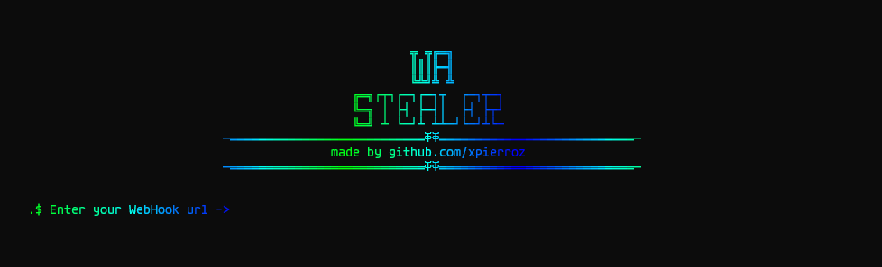

<h1 align="center">
   
  
  
   
   
 Whatsapp Stealer
   
</h1>

     
    <b>
        POC | Steal people Whatsapp Session information 
    </b>

## WhatsApp Stealer

This program is a POC that's its actually very easy to steal anyone's WhatsApp data

## How it works

The victim's payload will actually make a zip of all the WhatsApp data located at `LOCALAPPDATA\\Packages\\5319275A.WhatsAppDesktop_cv1g1gvanyjgm` 
Then, it's gonna uplaod it to the gofile API and send to the webhook the link

## Warning

This tool is explicitly designed and provided exclusively for educational intentions. Its primary objective is to illuminate the vulnerabilities that files can be susceptible to, highlighting the need for proactive security measures. It is imperative that this tool is never leveraged for any illegal, unauthorized, or malicious undertakings. Under no circumstances will I assume liability for any detrimental consequences inflicted upon your computing infrastructure. I hereby absolve myself from any complicity in activities of an illicit nature. Emphatically, this tool's utility is confined to didactic objectives.

This project is licensed under the <a href="https://mit-license.org/.">MIT License</a>

<a href=#top>Back to Top</a>

